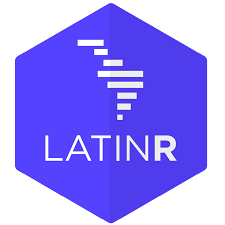
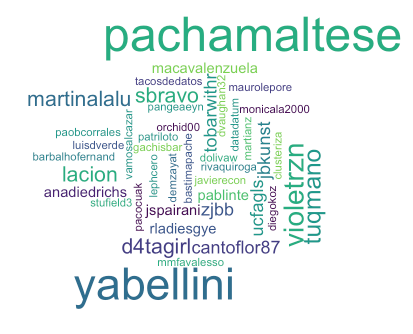
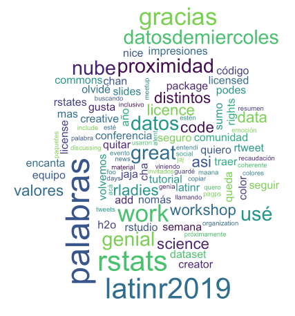
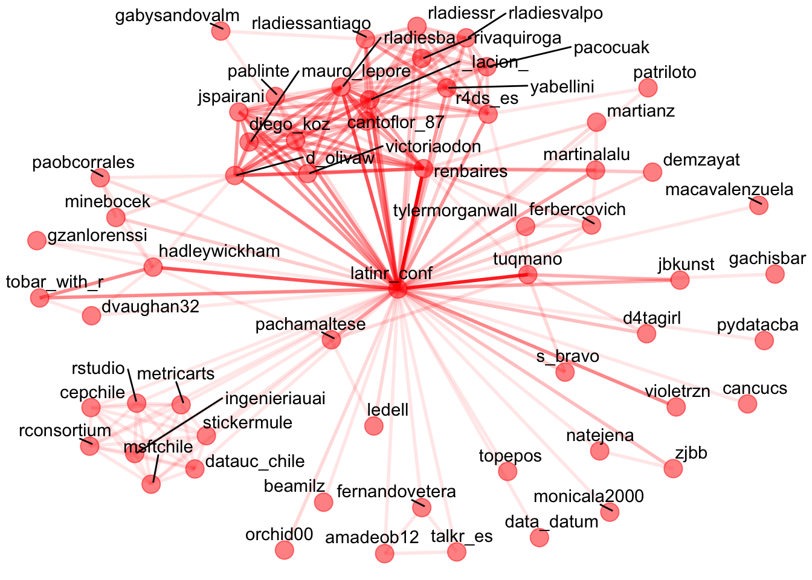

### Mi primer aporte al #datosdemiercoles y en realidad no usé los datos... ¯\\_(ツ)_/¯ 

Nube de palabras con los usuarios que mencionaron @LatinR_conf

Qué palabras se usaron más en esos tweets, sacando las menciones y las urls?

Red de los usuarios que hablaron de la LatinR_conf y cómo se vincularon entre ellos. Cuanto más oscura la línea más interacciones :)

